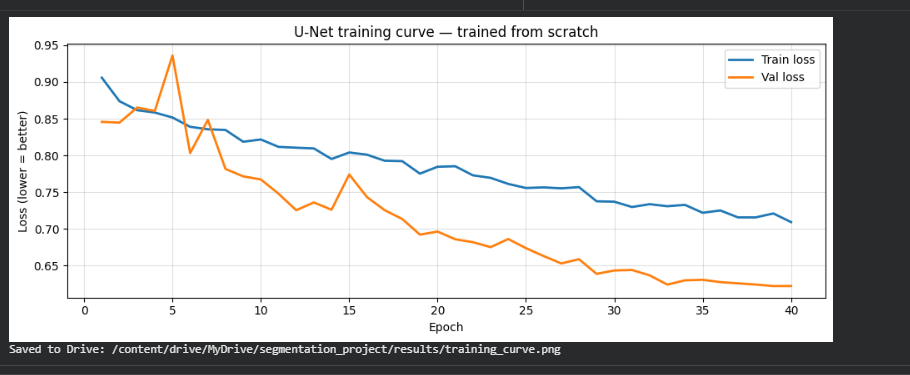
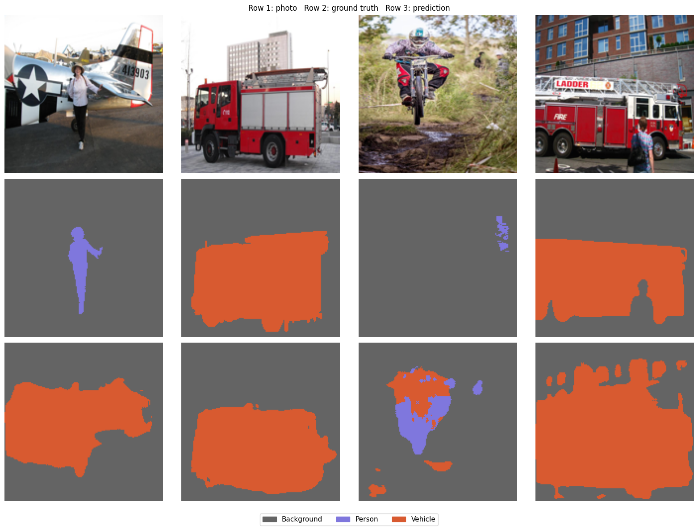

# 🧠 Image Segmentation with Attention U-Net

<div align="center">


**Pixel-level image segmentation of real-world photos built entirely from scratch using PyTorch.**
Every pixel in a photo gets labelled as one of four classes — no pretrained weights, no shortcuts.
Trained on Google OpenImages v7 using a custom Attention U-Net on a single GPU.

</div>

---

## 📋 Table of Contents

- [What This Project Does](#-what-this-project-does)
- [Classes and Labels](#-classes-and-labels)
- [Dataset](#-dataset--openimages-v7)
- [Data Pipeline](#-data-pipeline)
- [How the Model Works](#-how-the-model-works)
- [Training Setup](#-training-setup)
- [Results](#-results)
- [Project Structure](#-project-structure)
- [Key Design Decisions](#-key-design-decisions)
- [Technology Stack](#-technology-stack)
- [References](#-references)

---

## 🎯 What This Project Does

Given any photo, the model colours every single pixel according to what it belongs to. Not just a bounding box around an object — every pixel gets its own label. This is called **semantic segmentation**.

```
┌──────────────────────────────────────────────────────────────────────┐
│                                                                      │
│   INPUT                              OUTPUT                          │
│                                                                      │
│   Any street or outdoor photo  →     Pixel-level coloured mask       │
│                                                                      │
│   [dog in park]                →     ░░░░░░░░░░░░░░░░░░ Background   │
│   [car on road]                →     ████████████████ Car            │
│   [plane in sky]               →     ▓▓▓▓▓▓▓▓▓▓▓▓▓▓▓▓ Airplane      │
│   [dog running]                →     ▒▒▒▒▒▒▒▒▒▒▒▒▒▒▒▒ Dog           │
│                                                                      │
└──────────────────────────────────────────────────────────────────────┘
```

A 160×160 image requires 25,600 individual pixel-level decisions per forward pass. The model makes all of them in one shot.

---

## 🏷️ Classes and Labels

The model segments images into **4 classes**. Each class has a fixed integer index stored as the pixel value in the label map and a unique colour for visualisation.

```
┌────────────────────────────────────────────────────────────────────────┐
│                         CLASS DEFINITIONS                              │
├───────────┬──────────────┬──────────────────┬─────────────────────────┤
│   Index   │  Class Name  │  Mask Colour     │  What it covers         │
├───────────┼──────────────┼──────────────────┼─────────────────────────┤
│     0     │  Background  │  Gray            │  Road, sky, grass,      │
│           │              │  RGB(100,100,100)│  buildings, anything    │
│           │              │                  │  not in the 3 classes   │
├───────────┼──────────────┼──────────────────┼─────────────────────────┤
│     1     │  Car         │  Orange          │  Cars of any kind,      │
│           │              │  RGB(216, 90, 48)│  any angle, any size    │
├───────────┼──────────────┼──────────────────┼─────────────────────────┤
│     2     │  Airplane    │  Blue            │  Aircraft — commercial, │
│           │              │  RGB(66, 133,244)│  military, any type     │
├───────────┼──────────────┼──────────────────┼─────────────────────────┤
│     3     │  Dog         │  Green           │  Any dog breed,         │
│           │              │  RGB(52, 168, 83)│  full or partial body   │
└───────────┴──────────────┴──────────────────┴─────────────────────────┘
```

> **Why these three classes?**
> Car, Airplane, and Dog are visually about as different from each other as you can get — completely different shapes, sizes, textures, and contexts. A dog looks nothing like a plane. A plane looks nothing like a car. This makes them easier for a from-scratch model to separate cleanly, which leads to better training signal and more interpretable results.

---

## 📦 Dataset — OpenImages v7

**Google OpenImages v7** is one of the largest publicly available image datasets, with around 9 million photos annotated by professional human labellers.

```
┌─────────────────────────────────────────────────────────────────┐
│                    OPENIMAGES V7 — KEY FACTS                    │
├─────────────────────────────────────────────────────────────────┤
│  Total images              │  ~9 million                        │
│  Segmentation masks        │  2.8 million objects               │
│  Segmentation classes      │  350 classes                       │
│  Licence                   │  CC BY 4.0 (free for any use)      │
│  Download tool             │  FiftyOne Python library           │
└─────────────────────────────────────────────────────────────────┘
```

### Splits used

| Split | Purpose | Count |
|:---:|:---:|:---:|
| `train` | Teaching the model | 2,000 images |
| `test` | Final evaluation only — never seen during training | 200 images |

### Pixel distribution in training data

After downloading and converting masks, here is how pixels are distributed across the 2,000 training images:

| Class | Total Pixels | Frequency | Class Weight |
|:---|:---:|:---:|:---:|
| Background | 1,172,840,490 | 78.015% | 0.0549 |
| Car | 249,743,505 | 16.612% | 0.2578 |
| Dog | 55,249,821 | 3.675% | 1.1651 |
| Airplane | 25,522,600 | 1.698% | 2.5222 |

Background dominates at 78% which is expected — most of any photo is not a car, plane, or dog. This imbalance is handled through **median frequency class weighting** (explained in Training Setup).

---

## 🔄 Data Pipeline

```
╔══════════════════════════════════════════════════════════════════╗
║                        DATA PIPELINE                            ║
╚══════════════════════════════════════════════════════════════════╝

STEP 1 — DOWNLOAD
┌──────────────────────────────────────────────────────────────────┐
│  FiftyOne connects to OpenImages v7                              │
│  Downloads only photos containing Car, Airplane, or Dog          │
│  2,000 training images  +  200 test images                       │
│  Each image comes with per-instance binary mask PNGs             │
└──────────────────────────┬───────────────────────────────────────┘
                           │
                           ▼
STEP 2 — MASK CONVERSION
┌──────────────────────────────────────────────────────────────────┐
│  OpenImages gives one black/white PNG per object instance        │
│  We merge all instances into one single label map per photo      │
│                                                                  │
│  For each object detected:                                       │
│    1. Read bounding box coordinates (normalised 0–1)             │
│    2. Convert to pixel coordinates using image size              │
│    3. Resize binary mask to match bounding box pixels            │
│    4. Paint class index into label map at that location          │
│                                                                  │
│  Saved as PNG — pixel value = class index (0, 1, 2, or 3)       │
└──────────────────────────┬───────────────────────────────────────┘
                           │
                           ▼
STEP 3 — SAVE TO GOOGLE DRIVE
┌──────────────────────────────────────────────────────────────────┐
│  segmentation_project_v2/data/train/images/  ← 2,000 photos     │
│  segmentation_project_v2/data/train/masks/   ← 2,000 label maps │
│  segmentation_project_v2/data/test/images/   ←   200 photos     │
│  segmentation_project_v2/data/test/masks/    ←   200 label maps │
└──────────────────────────┬───────────────────────────────────────┘
                           │
                           ▼
STEP 4 — AUGMENTATION  (training split only)
┌──────────────────────────────────────────────────────────────────┐
│  Transform              │  Probability  │  Effect                │
│  ───────────────────────┼───────────────┼──────────────────────  │
│  Horizontal flip        │  0.50         │  Mirror left/right     │
│  Vertical flip          │  0.10         │  Mirror up/down        │
│  Random 90° rotation    │  0.20         │  Rotate                │
│  Colour jitter          │  0.40         │  Vary brightness       │
│  Gaussian blur          │  0.20         │  Slight blur           │
│  ImageNet normalise     │  1.00         │  Always applied        │
│                                                                  │
│  Spatial transforms applied to image AND mask in sync            │
└──────────────────────────┬───────────────────────────────────────┘
                           │
                           ▼
STEP 5 — COPY TO LOCAL SSD  (once per Colab session)
┌──────────────────────────────────────────────────────────────────┐
│  Google Drive (~10 MB/s)  →  Local SSD (~500 MB/s)               │
│  One-time copy at session start — all training reads from SSD    │
└──────────────────────────┬───────────────────────────────────────┘
                           │
                           ▼
STEP 6 — PYTORCH DATALOADER
┌──────────────────────────────────────────────────────────────────┐
│  batch_size=16  │  num_workers=2  │  pin_memory=True             │
│  shuffle=True (train)  │  shuffle=False (test)                   │
└──────────────────────────────────────────────────────────────────┘
```

---

## 🏗️ How the Model Works

The model is an **Attention U-Net** — a U-shaped encoder-decoder network with attention gates at every skip connection. Everything was written from scratch in PyTorch with no pretrained weights.

### The big picture

The encoder shrinks the image progressively — 160×160 → 80×80 → 40×40 → 20×20 → 10×10 — learning increasingly abstract features at each step. The decoder expands it back up to the original size, painting class labels as it goes. Skip connections pass fine-grained detail from the encoder to the decoder at each resolution level so boundaries stay sharp.

```
╔══════════════════════════════════════════════════════════════════════╗
║                        ATTENTION U-NET                              ║
║  INPUT  (batch, 3, 160, 160)  — RGB photo                           ║
╚══════════════════════════════════════════════════════════════════════╝

  ENCODER (left — shrinks)              DECODER (right — grows)

  ┌─────────────────┐                       ┌─────────────────┐
  │  DoubleConv     │                       │  DoubleConv     │
  │  3 → 64 ch      │──── AttentionGate ───►│  128 → 64 ch    │
  │  160 × 160      │                       │  160 × 160      │
  └────────┬────────┘                       └────────▲────────┘
           │  MaxPool (÷2)                           │  ConvTranspose (×2)
  ┌─────────────────┐                       ┌─────────────────┐
  │  DoubleConv     │                       │  DoubleConv     │
  │  64 → 128 ch    │──── AttentionGate ───►│  256 → 128 ch   │
  │  80 × 80        │                       │  80 × 80        │
  └────────┬────────┘                       └────────▲────────┘
           │  MaxPool (÷2)                           │  ConvTranspose (×2)
  ┌─────────────────┐                       ┌─────────────────┐
  │  DoubleConv     │                       │  DoubleConv     │
  │  128 → 256 ch   │──── AttentionGate ───►│  512 → 256 ch   │
  │  40 × 40        │                       │  40 × 40        │
  └────────┬────────┘                       └────────▲────────┘
           │  MaxPool (÷2)                           │  ConvTranspose (×2)
  ┌─────────────────┐                       ┌─────────────────┐
  │  DoubleConv     │                       │  DoubleConv     │
  │  256 → 512 ch   │──── AttentionGate ───►│  1024 → 512 ch  │
  │  20 × 20        │                       │  20 × 20        │
  └────────┬────────┘                       └────────▲────────┘
           └──────────────► BOTTLENECK ──────────────┘
                            512 → 1024 ch  │  10 × 10

  OUTPUT  (batch, 4, 160, 160) — argmax → one class per pixel
```

### What attention gates actually do

Standard skip connections pass everything across — useful detail and noise together. Attention gates sit in front of each skip connection and learn a weight between 0 and 1 for every pixel. Pixels relevant to what the decoder is currently building pass through strongly. Irrelevant pixels get suppressed. This is particularly helpful for detecting smaller objects like dogs that would otherwise get drowned out by background.

### Model specifications

| Parameter | Value |
|:---|:---|
| Architecture | Attention U-Net |
| Encoder channels | `[64, 128, 256, 512]` |
| Bottleneck channels | `1024` |
| Input size | `160 × 160 × 3` |
| Output size | `160 × 160 × 4` |
| Total parameters | **31,388,396** |
| Dropout (encoder) | `0.1` |
| Dropout (bottleneck) | `0.2` |
| Pretrained weights | **None — trained from scratch** |

---

## ⚙️ Training Setup

```
  Platform  :  Google Colab
  GPU       :  NVIDIA Tesla T4  (16 GB VRAM)
  Epochs    :  60  (early stopping patience = 12)
  Batch     :  16 images per batch
```

### Class weights — SegNet Median Frequency Balancing

Because 78% of pixels are background, a naive model can just predict background everywhere and still look okay on paper. To stop this, we weight each class inversely to how common it is:

```
  freq[c]    =  pixels_of_class_c / total_pixels
  median_f   =  median( freq[0], freq[1], freq[2], freq[3] )
  weight[c]  =  median_f / freq[c]   (capped between 0.05 and 10)
```

The actual weights computed from our 2,000 training images:

| Class | Frequency | Weight | Effect |
|:---|:---:|:---:|:---|
| Background | 78.015% | 0.0549 | Very low — background is easy |
| Car | 16.612% | 0.2578 | Low-medium |
| Dog | 3.675% | 1.1651 | High — rarely seen |
| Airplane | 1.698% | 2.5222 | Highest — rarest class |

Median frequency used: **10.144%**. A mistake on an Airplane pixel is penalised about 46x more than a Background pixel, forcing the model to actually learn rare classes instead of ignoring them.

### Combined loss function

```
  Total Loss  =  0.5 × CrossEntropyLoss  +  0.5 × DiceLoss

  CrossEntropyLoss  →  per-pixel classification with class weights
  DiceLoss          →  measures mask overlap, cleans up boundaries
```

### Learning rate schedule

```
  Optimiser  :  AdamW   lr = 1e-3   weight_decay = 1e-4
  Scheduler  :  Linear warmup (epochs 0–5) + Cosine decay (epochs 5–60)
  Grad clip  :  max_norm = 1.0

  LR
  1e-3 ─────────╮
                 ╲
  warmup          ╲  cosine decay
  0 ─────────╯    ╲──────────────► epoch
  0           5                60
```

---

## 📊 Results

### Training Curve



Both losses decrease consistently across all 60 epochs. The validation loss stays below the training loss throughout the entire run — this is a sign of good generalisation rather than overfitting. The warmup phase in epochs 0–5 stabilises the early training, and both curves continue declining smoothly all the way to epoch 60. The gap between train and val loss is healthy and stable, meaning the model learned general patterns rather than memorising training images.

---

### Sample Predictions



Each group shows: original photo on top, correct ground truth mask in the middle, model prediction on the bottom. Dog segmentation is particularly strong — the model captures the shape cleanly. Cars produce good outlines. Airplanes work well when they are large in frame. Background sometimes bleeds into object boundaries, which is expected at 160×160 resolution where fine edges lose detail.

---

### Confusion Matrix

Each row is the **true class**. Each column is what the model **predicted**. Each row sums to 1.00. The diagonal is correct predictions — the brighter the better.

| True \ Predicted | Background | Car | Airplane | Dog |
|:---:|:---:|:---:|:---:|:---:|
| **Background** | **0.63** ✅ | 0.13 | 0.11 | 0.13 |
| **Car** | 0.07 | **0.84** ✅ | 0.08 | 0.01 |
| **Airplane** | 0.08 | 0.07 | **0.83** ✅ | 0.02 |
| **Dog** | 0.04 | 0.02 | 0.02 | **0.92** ✅ |

**Reading the matrix:**

- **Background (0.63):** The weakest diagonal. 37% of true background pixels are predicted as one of the three objects. This is the classic over-segmentation problem — the model finds objects in regions that are actually background. Most leakage goes equally to Car (0.13), Airplane (0.11), and Dog (0.13).

- **Car (0.84):** Strong. Only 7% lost to Background and 8% confused with Airplane — which makes sense since both are large metal objects with similar textures.

- **Airplane (0.83):** Strong. Slightly more confusion with Car (0.07) than expected, again because of shared visual texture between vehicles.

- **Dog (0.92):** The best performing class. Only 4% lost to Background. Dogs have such a distinct organic shape that the model learned them most reliably despite being rare at 3.7% of pixels.

---

### Per-Class Metrics — 200 Unseen Test Images

**Overall pixel accuracy: 69.22%**

| Class | Precision | Recall | F1 Score | Support (pixels) |
|:---|:---:|:---:|:---:|:---:|
| Background | 0.9702 | 0.6326 | 0.7658 | 3,864,680 |
| Car | 0.3445 | 0.8427 | 0.4891 | 344,827 |
| Airplane | 0.3791 | 0.8305 | 0.5206 | 332,913 |
| Dog | 0.5178 | 0.9211 | 0.6629 | 577,580 |
| **Macro avg** | **0.5529** | **0.8067** | **0.6096** | 5,120,000 |
| Weighted avg | 0.8386 | 0.6922 | 0.7196 | 5,120,000 |

**What these numbers mean in plain English:**

- **Background (F1 = 0.77):** Precision is extremely high at 0.97 — when the model says something is background, it is almost always right. But recall is only 0.63, meaning it misses 37% of true background pixels by labelling them as objects. The model is a bit trigger-happy with detecting objects in background regions.

- **Car (F1 = 0.49):** Recall is strong at 0.84 — the model finds most cars. But precision is only 0.34, meaning it also labels many non-car regions as car. Over-prediction rather than under-detection.

- **Airplane (F1 = 0.52):** Similar pattern to Car. Recall 0.83 means it rarely misses a plane. Low precision 0.38 means it sometimes assigns the plane label to regions that are actually background or car — likely because it has the least training data at 1.7% of pixels.

- **Dog (F1 = 0.66):** Best foreground class. Recall 0.92 is excellent — the model finds almost every dog. Precision 0.52 means some false positives, but the overall balance is the best of the three object classes.

> **Context:** This model was trained entirely from scratch with zero pretrained weights on 2,000 images. A macro F1 of 0.61 and 69% pixel accuracy is a solid result under these constraints. The dominant pattern across all classes is strong recall with weaker precision — the model is good at finding objects but sometimes finds them where they aren't. Using pretrained encoder weights would significantly improve precision.

---

## 📁 Project Structure

```
segmentation_project_v2/                 (Google Drive root)
│
├── 📂 data/
│   ├── 📂 train/
│   │   ├── 📂 images/                   ← 2,000 training photos (.jpg)
│   │   └── 📂 masks/                    ← 2,000 label maps (.png)
│   │                                       pixel value: 0=bg 1=car 2=plane 3=dog
│   └── 📂 test/
│       ├── 📂 images/                   ← 200 test photos (.jpg)
│       └── 📂 masks/                    ← 200 label maps (.png)
│
├── 📂 results/
│   ├── best_model_v2.pth                ← best checkpoint (~120 MB)
│   ├── evaluation_results.txt           ← precision / recall / F1
│   ├── training_curve.png               ← loss over 60 epochs
│   ├── confusion_matrix.png             ← normalised per-class confusion
│   ├── sample_predictions.png           ← photo / truth / prediction
│   └── data_check.png                   ← data sanity check
│
└── 📓 segmentation_notebook.ipynb
    ├── Cell 1   Install + mount Drive + GPU check
    ├── Cell 2   All constants and settings
    ├── Cell 3   Download from OpenImages via FiftyOne
    ├── Cell 4   Visual data check
    ├── Cell 5   AttentionUNet model definition
    ├── Cell 6   Dataset + class weights + combined loss
    ├── Cell 7A  Copy Drive data to local SSD
    ├── Cell 7B  Create DataLoaders
    ├── Cell 7C  Training loop with early stopping
    ├── Cell 8   Plot training curve
    ├── Cell 9   Evaluate on 200 test images
    ├── Cell 10  Confusion matrix + visual predictions
    └── Cell 11  Drive file summary
```

---

## 🔑 Key Design Decisions

```
┌──────────────────────────────────────────────────────────────────────────┐
│  DECISION             │  CHOICE                 │  REASON                │
├───────────────────────┼─────────────────────────┼────────────────────────┤
│  Classes chosen       │  Car, Airplane, Dog      │  Visually maximally    │
│                       │                          │  distinct — no         │
│                       │                          │  overlap in shape      │
├───────────────────────┼─────────────────────────┼────────────────────────┤
│  Architecture         │  Attention U-Net         │  Built for segmentation│
│                       │                          │  skip connections keep │
│                       │                          │  spatial detail        │
├───────────────────────┼─────────────────────────┼────────────────────────┤
│  Pretrained weights   │  None — from scratch     │  Academic constraint   │
├───────────────────────┼─────────────────────────┼────────────────────────┤
│  Loss function        │  CE + Dice  (50/50)      │  CE: per-pixel acc     │
│                       │                          │  Dice: shape overlap   │
├───────────────────────┼─────────────────────────┼────────────────────────┤
│  Class weighting      │  SegNet median freq      │  78% background would  │
│                       │                          │  dominate without it   │
├───────────────────────┼─────────────────────────┼────────────────────────┤
│  LR schedule          │  Warmup + cosine decay   │  Stable early training │
├───────────────────────┼─────────────────────────┼────────────────────────┤
│  Data storage         │  Drive → SSD copy        │  50x faster reads      │
│                       │  at session start        │  per training epoch    │
├───────────────────────┼─────────────────────────┼────────────────────────┤
│  Early stopping       │  Patience = 12           │  Saves best checkpoint │
│                       │                          │  prevents overfitting  │
└───────────────────────┴─────────────────────────┴────────────────────────┘
```

---

## 🛠️ Technology Stack

| Library | Purpose |
|:---|:---|
| **PyTorch** | Neural network, training loop, GPU computation |
| **torchvision** | Functional image transforms |
| **Albumentations** | Fast image and mask augmentation |
| **FiftyOne** | OpenImages v7 download and management |
| **Pillow** | Image loading, resizing, mask conversion |
| **NumPy** | Array operations, mask manipulation |
| **scikit-learn** | Precision, recall, F1, confusion matrix |
| **Matplotlib** | Training curves and visualisations |
| **Google Colab** | Cloud GPU notebook (Tesla T4) |
| **Google Drive** | Persistent data and model storage |

---

## 📚 References

| Paper | Authors | Year | Used for |
|:---|:---|:---:|:---|
| [U-Net: Convolutional Networks for Biomedical Image Segmentation](https://arxiv.org/abs/1505.04597) | Ronneberger et al. | 2015 | Base architecture |
| [Attention U-Net: Learning Where to Look for the Pancreas](https://arxiv.org/abs/1804.03999) | Oktay et al. | 2018 | Attention gates |
| [SegNet: A Deep Convolutional Encoder-Decoder Architecture](https://arxiv.org/abs/1511.00561) | Badrinarayanan et al. | 2017 | Class weighting formula |
| [V-Net: Fully Convolutional Neural Networks for Volumetric Segmentation](https://arxiv.org/abs/1606.04797) | Milletari et al. | 2016 | Dice loss |
| [The Open Images Dataset V4](https://arxiv.org/abs/1811.00982) | Kuznetsova et al. | 2020 | Dataset |

---

<div align="center">

**Built with PyTorch &nbsp;·&nbsp; Trained on OpenImages v7 &nbsp;·&nbsp; Google Colab T4**

</div>
